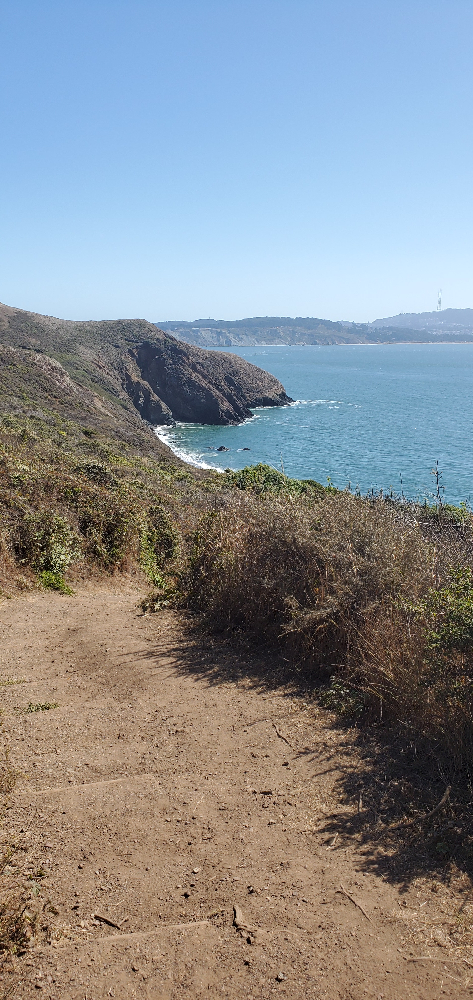

## How to use

##### 1. Add the following to your build.gradle:
```groovy
compile 'com.github.rubensousa:floatingtoolbar:1.5.1'
```
##### 2. Add FloatingToolbar as a direct child of CoordinatorLayout and before the FloatingActionButton:
```xml
<android.support.design.widget.CoordinatorLayout 
    xmlns:android="http://schemas.android.com/apk/res/android"
    xmlns:app="http://schemas.android.com/apk/res-auto"
    android:id="@+id/coordinatorLayout"
    android:layout_width="match_parent"
    android:layout_height="match_parent"
    android:fitsSystemWindows="true">
    
    <!-- Appbar -->

    <com.github.rubensousa.floatingtoolbar.FloatingToolbar
        android:id="@+id/floatingToolbar"
        android:layout_width="match_parent"
        android:layout_height="?attr/actionBarSize"
        android:layout_gravity="bottom"
        app:floatingMenu="@menu/main" />

    <android.support.design.widget.FloatingActionButton
        android:id="@+id/fab"
        android:layout_width="wrap_content"
        android:layout_height="wrap_content"
        android:layout_gravity="bottom|end"
        android:layout_margin="@dimen/fab_margin"
        android:src="@drawable/ic_share_black_24dp" />
        
        
</android.support.design.widget.CoordinatorLayout>
```
##### 3. Specify a menu resource file or custom layout with app:floatingMenu or app:floatingCustomView

You can also build a menu programmatically using FloatingToolbarMenuBuilder:

```java
 mFloatingToolbar.setMenu(new FloatingToolbarMenuBuilder(this)
                .addItem(R.id.action_unread, R.drawable.ic_markunread_black_24dp, "Mark unread")
                .addItem(R.id.action_copy, R.drawable.ic_content_copy_black_24dp, "Copy")
                .addItem(R.id.action_google, R.drawable.ic_google_plus_box, "Google+")
                .addItem(R.id.action_facebook, R.drawable.ic_facebook_box, "Facebook")
                .addItem(R.id.action_twitter, R.drawable.ic_twitter_box, "Twitter")
                .build());
```

##### 4. Attach the FAB to the FloatingToolbar to automatically start the transition on click event:

```java
mFloatingToolbar.attachFab(fab);
```

##### 5. Set a click listener
```java
mFloatingToolbar.setClickListener(new FloatingToolbar.ItemClickListener() {
            @Override
            public void onItemClick(MenuItem item) {
                
            }

            @Override
            public void onItemLongClick(MenuItem item) {

            }
        });
```

##### 6. If you want to show a snackbar in the same layout as the FloatingToolbar, please use:

```java
mFloatingToolbar.showSnackBar(snackbar);
```

##### 7. (Optional) Attach a RecyclerView to hide the FloatingToolbar on scroll:

```java
mFloatingToolbar.attachRecyclerView(recyclerView);
```

##### 8. (Optional) Use show() and hide() to trigger the transition anytime:

```java
mFloatingToolbar.show();
mFloatingToolbar.hide();
```      
  
##### 9. (Optional) Add a MorphListener to listen to morph animation events

```java
mFloatingToolbar.addMorphListener(new FloatingToolbar.MorphListener() {
    @Override
    public void onMorphEnd() {
        
    }

    @Override
    public void onMorphStart() {

    }

    @Override
    public void onUnmorphStart() {

    }

    @Override
    public void onUnmorphEnd() {

    }
});
``` 


## Welcome to Huck's Travel Blog

```markdown
A Weekend in San Francisco 
```

I decided to post a Reddit missed connection in the "Burning Man Missed Connections" thread following a fantastic week frolicking in the Nevada Desert. Through the wonders of new age technology, I was able to get in contact with my slightly elusive lover Max! He invited me to stay with him for a couple days at his house in Oakland and we explored the wonderful Bay area. If you are traveling to Frisco here are some things I suggest that you check out! Hope this travel blog helps you on your adventures. 

**1. San Francisco Crosstown Trail -** By far, my favorite moments of the San Francisco trip were during my exploration of the less touristy parts of the city. Full instructions, including a trail map and a step-by-step list of directions can be found at the following link. The trail does include hills, stairs, many ups and downs. Wear comfortable walking shoes, bring snacks, water and a smile. Explore the unseen parts of the city while exercising in some of the cleanest metropolitan city air in the world. The trail can be split up in multiple parts or days, however you would like. Makesure you stop at [Louis'](http://louissf.com/index.html/) for a good American diner style meal at the end of a hard day's walk, bring cash!
[More Info](https://sfist.com/2019/06/03/new-17-mile-san-francisco-crosstown-trail-connects-citys-parks-hiking-trails-and-little-known-outdoor-gems/)


**2. Black Sands Beach -** A clothing optional beach on the north side of the Golden Gate Bridge. This beach can get windy so bring clothes just in case. 
[Link](https://www.californiabeaches.com/beach/black-sands-beach-marin-headlands/)

**3. Folsom District -** Leave it to the gays to fly the biggest, rainbow flag in the city of San Francisco. Travel to this area on the F train if you are looking for a cool, retro way of intercity travel.

**4. Archimedes "Baynas" -** This bathhouse is nestled on the edge of the bay water in the south east side of San Francisco. A nude/clothing optional, Russian bathhouse with spa treatments, aromatherapy, that also includes a full bar and restuarant. A chic, amazing experience to pamper yourself and your significant other with a day at the spa. Weekends can get crowded so get there early!
[Baynas](http://www.banyasf.com/)

**5. Aunt Charlies -** If you want a divey gay bar in the heart of the Tenderloin district, look no further than Aunt Charlies. Cover and drinks are reasonably priced, the local drag scene is alternative and diverges from the more "in the mainstream" moment that is created by RuPaul girls. 
[AuntCharliesReview](https://www.yelp.com/biz/aunt-charlies-lounge-san-francisco)


The aforementioned Reddit post can be found [Here](https://www.reddit.com/r/BurningMan/comments/cyuf4u/missed_connections/eyv2bph/)


 The view from the staircase descent, **Black Sand Beach**     |    My Favorite Part of the hike, **The 16th Avenue Tiled Steps**


     |    
  
  More information about the tiled steps can be found [here](http://www.16thavenuetiledsteps.com/).

```
```
